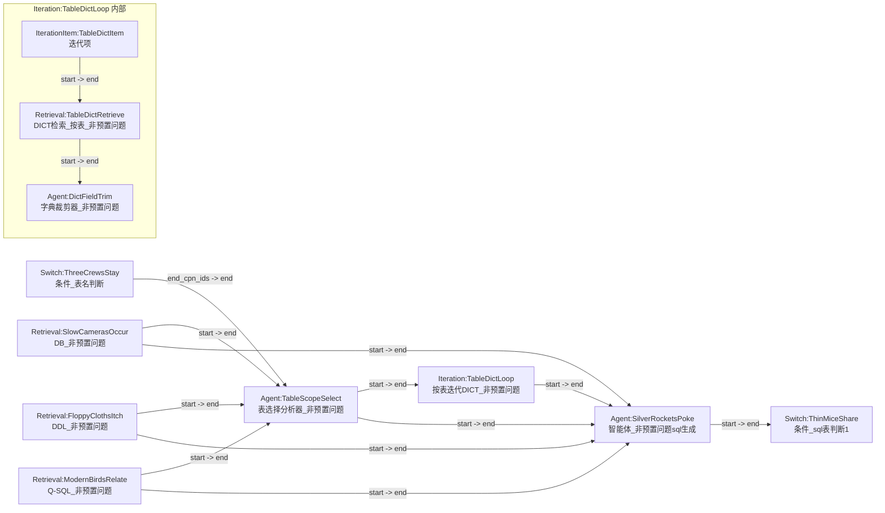

# 非预置问题链路_表先行_精确节点连接图

## 1. 主链路

## 2. 需要新增的边

| source | sourceHandle | target | targetHandle |
| --- | --- | --- | --- |
| `Switch:ThreeCrewsStay` | `end_cpn_ids` | `Agent:TableScopeSelect` | `end` |
| `Retrieval:SlowCamerasOccur` | `start` | `Agent:TableScopeSelect` | `end` |
| `Retrieval:FloppyClothsItch` | `start` | `Agent:TableScopeSelect` | `end` |
| `Retrieval:ModernBirdsRelate` | `start` | `Agent:TableScopeSelect` | `end` |
| `Agent:TableScopeSelect` | `start` | `Iteration:TableDictLoop` | `end` |
| `IterationItem:TableDictItem` | `start` | `Retrieval:TableDictRetrieve` | `end` |
| `Retrieval:TableDictRetrieve` | `start` | `Agent:DictFieldTrim` | `end` |
| `Agent:TableScopeSelect` | `start` | `Agent:SilverRocketsPoke` | `end` |
| `Retrieval:SlowCamerasOccur` | `start` | `Agent:SilverRocketsPoke` | `end` |
| `Iteration:TableDictLoop` | `start` | `Agent:SilverRocketsPoke` | `end` |

## 3. 需要删除的旧边

| source | sourceHandle | target | targetHandle |
| --- | --- | --- | --- |
| `Switch:ThreeCrewsStay` | `end_cpn_ids` | `Agent:SilverRocketsPoke` | `end` |
| `Agent:SilverRocketsPoke` | `tool` | `Tool:PlentyBathsFix` | `end` |

## 4. 需要删除的旧节点

- `Tool:PlentyBathsFix`

## 5. 需要调整但不是新增的节点

- `Agent:SilverRocketsPoke`
  - 改为消费 `表选择结果 + DB + DDL + Q-SQL + 按表裁剪后的字典值`
  - 移除内置 DICT tool
- `Agent:SweetJokesHear`
  - 用户提示词补充 `字段字典值：{Iteration:DullBagsYawn@dicts1}`
